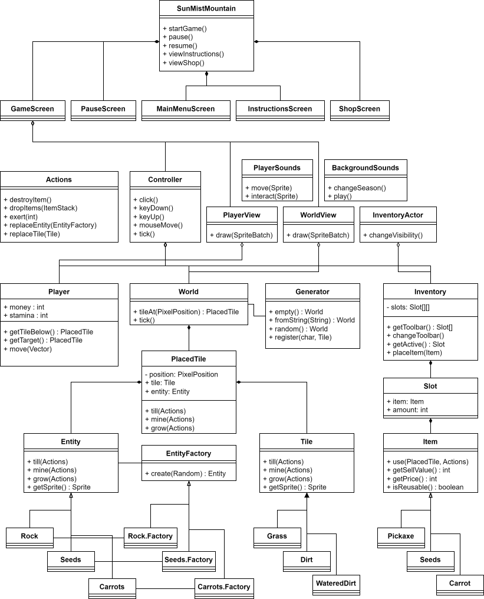

# Rapport – innlevering 4
**Team:** Team Undefined – Alf Bjarne Klæhaug, Eivind Bjørnbakken Eide, Håkon
Sørensen, Oscar Gussiås

Møtereferater i [doc/Møte_referat/April](Møte_referat/April/).

## Prosjektrapport

- Rollene fungerer fortsatt bra. Siden forrige oblig har alle hovedsakelig bare
  jobbet med programmeringsarbeidet.
- Målet vårt var å bruke TDD, parprogrammering og Kanban som prosjektmetodikk,
  men i praksis ble vi litt slapp på å gjøre dette. Vi brukte møtene effektivt
  til å fordele oppgaver og å hjelpe hverandre, men dette var noe mer
  ustrukturert enn det vi hadde planlagt.
- Gruppedynamikken er bra og kommunikasjon fungerer greit.
- Selv om metodikken ikke har vært fulgt helt presists har prosjektet fungert
  bra. Vi har fordelt oppgaver bra og klart å møte målene vi har satt oss. Vi
  har klart å skrive gode tester som har hjulpet oss å skrive rett kode og å
  passe på at alt fungerer, selv om vi ikke alltid har vært like flinke til å
  skrive testene først.
- Hovedsakelig går forskjellen på mengden bidrag på den enkeltes arbeidsstil,
  og problemet med at Oscar og Alf sine commits er fordelt på flere brukere.

### Retrospektiv

- Vi kom fort igang med prosjektet og organiserte greit fra starten av. Vi har
  derfor aldri vært stresset eller merket at vi har dårlig tid.
- Vi har klart å jobbe bra både individuelt og sammen, og hjulpet hverandre når
  det trengs. Av og til var det en del mergekonflikter, men disse har generelt
  vært greie å ordne. Til større konflikter har vi hjulpet hverandre å løse dem.
- Vi kunne kanskje satt oss mer inn i hvordan libGDX og Maven enda tidligere,
  siden det ble noen store endringer vi måtte gjennomføre etter hvert som vi
  oppdaget bedre måter å strukturere prosjektet.
- Stardew Valley og lignende spill er ganske komplekse, og vårt er nokså enkelt
  i sammenligning. Vi kunne kanskje valgt noe enklere å etterligne dersom målet
  var å lage noe som var mer "gjennomført", men vi er fornøyd med valget og
  synes vi har laget en bra "prototype"

## Krav og spesifikasjon

- Vi har nå et spill hvor det er en game loop: man kan høste, plante, selge og
  kjøpe, man har stamina som brukes opp når man jobber og kan fylles opp igjen
  ved å spise gulrøtter.
- Siden sist har vi fullført kravene om planter, det å kunne styre inventory,
  og det å kunne selge og kjøpe items.

## Produkt og kode

- Vi har fikset slik at spillet ikke lenger kræsjer når man plasserer gulrøtter,
  at planter gror, og at man må kjøpe ulike items for å kunne bruke de.

### Klassediagram

## Konkrete vurderingskrav

- [x] Spillet har forside/hjelpeside

- [x] MVC-design
  - kontrollere i `Controller` håndterer input og timere
  - model i `Model` representerer verden
  - visning i `View` tegner til skjermen

- [x] Lyd koblet til hendelse
  - startet i ulike kontrollerklasser
  - implementert i `View.Sound`

- [x] Objektfabrikker
  - `Model.World.Generator` kan registrere tegn og tiles og bruke det til å
    generere en `Model.World.World`

- [x] Abstrakte objektfabrikker
  - `Model.Entities.EntityFactory` og dens underklasser brukes i
    `Model.Actions.TileAction` til å konstruere entities

- [x] Objekter som modifiserer oppførsel (powerups, etc)
  - Ulike items i `Model.Item` påvirker spilleren og verden på ulike vis: de kan
    endre tiles og entities, gi spilleren flere items, trekke eller gi spilleren
    stamina, osv.
